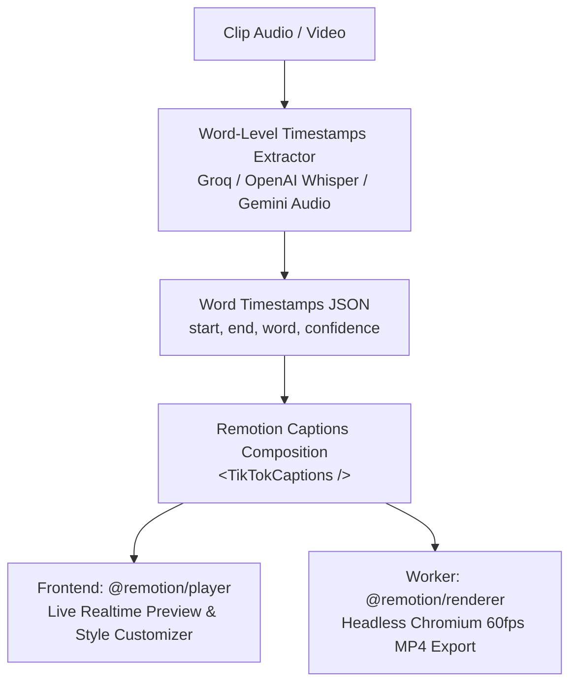

# YouTube Viral Clipper — Platform Implementation Plan

## 📌 Project Overview
Platform berbasis Next.js 16 (App Router) + React 19 + TypeScript + BullMQ + PostgreSQL + FFmpeg untuk memotong video YouTube secara otomatis menjadi klip pendek viral (Shorts / Reels / TikTok) dengan AI Analysis, Smart 9:16 Face Framing, dan Dynamic Animated Subtitles.

---

## 🏗️ System Architecture & Tech Stack

| Layer | Technology | Status |
|---|---|---|
| **Frontend & API** | Next.js 16.3.1 (App Router), React 19, CSS Modules & Tailwind CSS v4 | ✅ Production Ready |
| **Authentication** | Better Auth (Email/Password + Session Management) | ✅ Production Ready |
| **Database & ORM** | PostgreSQL 18 + Prisma ORM + pgvector extension | ✅ Production Ready |
| **Job Queue & Cache**| BullMQ + Valkey/Redis (localhost:6379) | ✅ Production Ready |
| **Worker Process** | Dedicated worker (`workers/index.ts`) via tsx / concurrently (`npm run dev:all`) | ✅ Production Ready |
| **AI Intelligence** | Google Gemini 2.5 Flash (Viral Analysis & Insights) | ✅ Production Ready |
| **Face AI & Framing**| `@vladmandic/face-api` + `@tensorflow/tfjs-node` + FFmpeg Auto-Crop 9:16 | ✅ Production Ready |
| **Media Processing** | FFmpeg n8.1 (Safe spawn execution) + yt-dlp | ✅ Production Ready |
| **Caption & Subtitle**| *Current:* FFmpeg ASS Burning (Legacy)<br/>*Upcoming:* **Remotion Subtitle Engine + Word-Level Timestamps** | 🔄 Modernizing to Remotion |

```
Browser
  │  (HTTPS)
  ▼
Next.js App (port 3000)
  ├── /api/auth/*           ← Better Auth (Login/Register/Session)
  ├── /api/projects/*       ← CRUD projects (Tenant isolation)
  ├── /api/videos/*         ← CRUD videos, enqueue BullMQ jobs
  ├── /api/clips/*          ← Serve clip video (Horizontal/Vertical), metadata
  ├── /api/jobs/*           ← Job status polling & progress tracking
  ├── /api/languages        ← Transcript languages
  └── /api/transcript       ← Fetch & cache YouTube transcript

PostgreSQL (localhost:5432)
  └── Database: viral_clipper (Prisma schema + pgvector)

Redis/Valkey (localhost:6379)
  └── BullMQ Queues:
      video → transcript → analysis → clip → face-detection → subtitle → embedding

Worker Process (npm run worker)
  ├── video.processor       → yt-dlp safe download
  ├── transcript.processor  → YouTube transcript fetch & save
  ├── analysis.processor    → Gemini AI viral ranking & clip suggestions
  ├── clip.processor        → FFmpeg precise cut (start-to-end seconds)
  ├── face.processor        → Face detection + 9:16 dynamic vertical auto-crop
  ├── subtitle.processor    → [NEW] Remotion renderMedia / FFmpeg subtitle burning
  └── embedding.processor   → Semantic vector embedding

Storage (Local Filesystem)
  └── storage/users/{userId}/
      ├── videos/{videoId}/source.mp4
      └── clips/{clipId}/
          ├── clip.mp4 (16:9)
          ├── clip_vertical.mp4 (9:16 Smart Crop)
          ├── clip_vertical_subtitled.mp4
          └── subtitle.srt
```

---

## 📋 Implementation Progress & Grouped Checklist

### 1. Core Authentication & Multi-Tenancy
- [✅] **User Authentication**: Register, Login, Session token management via Better Auth.
- [✅] **Tenant Data Isolation**: User A tidak dapat melihat atau memodifikasi project/video/klip milik User B (ownership check di semua API & database queries).
- [✅] **Security**: API key server-side only, validasi schema input via Zod, tidak ada command injection pada FFmpeg / yt-dlp (`spawn` array args).

### 2. Project & Video Management
- [✅] **Project Management**: Create project, list user projects, project detail view.
- [✅] **YouTube Video Ingestion**: Menerima YouTube URL, mengambil metadata (title, thumbnail, duration, channel) secara instan via oEmbed & yt-dlp.
- [✅] **Transcript Management**: Pengambilan transkrip YouTube (`youtube-transcript-plus`), selector bahasa transkrip, dan caching di PostgreSQL.

### 3. AI Viral Analysis & Suggestions
- [✅] **Gemini 2.5 Flash Analysis**: Menganalisis transkrip untuk menghasilkan TOP viral clips dengan scoring, hook explanation, summary, strengths, dan weaknesses.
- [✅] **Persistence**: Menyimpan hasil analisis dan metadata klip (start/end seconds, viral score, rank, category) ke database.

### 4. Background Job & Worker Infrastructure
- [✅] **Worker Terpisah**: Worker BullMQ berjalan independen via `npm run worker` atau `npm run dev:all`.
- [✅] **Job Status & Progress Tracking**: Progress bar 0-100% dan status (`QUEUED`, `PROCESSING`, `COMPLETED`, `FAILED`) terpantau secara realtime di frontend.
- [✅] **Job Retry & Error Handling**: Penanganan error job dengan penyimpanan pesan error ke database serta mekanisme retry.
- [✅] **Database Migration & TypeScript**: Prisma migration rapi dan tidak ada compile error pada TypeScript.

### 5. Media Processing & AI Smart Crop
- [✅] **Video Download & Clipping**: Worker mendownload video sumber via yt-dlp dan memotong klip 16:9 horizontal dengan FFmpeg.
- [✅] **Face Detection**: Deteksi wajah menggunakan `@vladmandic/face-api` + `@tensorflow/tfjs-node` untuk mendeteksi posisi pembicara di setiap interval.
- [✅] **AI Smart 9:16 Auto-Crop Framing**: Menghitung bounding box dan melakukan framing vertikal 9:16 terpusat pada wajah pembicara menggunakan FFmpeg crop filter.
- [✅] **Storage Abstraction**: Penyimpanan lokal terstruktur (`/storage/users/{userId}/...`) dengan interface abstraksi yang siap di-upgrade ke S3/R2.
- [✅] **Semantic Embedding**: Pipeline model embedding siap terhubung ke database.

---

## 🎯 Modernisasi Subtitle Engine: Integrasi Remotion & Word-Level Timestamps

### 🔴 Masalah pada Sistem Subtitle Lama (FFmpeg ASS Burning)
1. **Visual Terlalu Sederhana / Kaku**: Menggunakan filter FFmpeg `subtitles` dengan file ASS statis (font Arial standar tanpa animasi modern).
2. **Timing Subtitle Meleset / Aneh**: YouTube transcript hanya memberikan timestamps tingkat kalimat. Pemotongan kata selama ini dihitung dari estimasi panjang karakter (`weight = chunk.length / totalChars`), sehingga tidak sinkron dengan tempo bicara manusia.

### 🟢 Solusi: Arsitektur Subtitle Baru dengan Remotion



### 📦 Paket yang Digunakan
```bash
npm install remotion @remotion/player @remotion/renderer @remotion/bundler nodejs-whisper
```

---

## 🗺️ Roadmap Integrasi Remotion & Local Whisper (Completed)

### Phase 1 — Word-Level Timestamps Precision (Memperbaiki Timing)
- [✅] **Word-Level Transcription**: Integrasi `nodejs-whisper` (whisper.cpp) secara lokal untuk mengekstraksi word timestamps presisi (`{ word, start, end, confidence }`) langsung dari audio klip.
- [✅] **Timestamp Alignment Fallback**: Algoritma cerdas pemetaan fonetik dan jeda tanda baca sebagai fallback jika audio belum ditranskrip ulang.
- [✅] **Database Persistence**: Menyimpan SRT dan metadata Remotion cues/styleConfig (JSON) ke database `Subtitle`.

### Phase 2 — Remotion Component & Template Library (Memperbaiki Visual)
- [✅] **Remotion Composition Setup**: Konfigurasi root Remotion di Next.js (`remotion/index.ts`, `remotion/Root.tsx`, `remotion/compositions/TikTokCaptions.tsx`).
- [✅] **Viral Captions Preset Styles**:
  - **Hormozi Style**: Teks huruf kapital tebal kuning/hijau neon dengan animasi *scale pop-up* per kata aktif.
  - **Karaoke Wave**: Teks 2-3 baris dengan efek highlight warna dinamis mengikuti kata yang sedang diucapkan.
  - **Minimalist Modern**: Font bersih (Montserrat / Poppins) dengan container pill blur transparan (*glassmorphism*).
  - **Beast Pop**: Shadow tebal kontras tinggi dengan rotasi acak halus pada kata kunci emosional.

### Phase 3 — Interactive Subtitle Editor & Live Preview UI
- [✅] **Live Player**: Memasang `@remotion/player` pada `SubtitleStudioModal` untuk preview realtime tanpa render.
- [✅] **Style & Customization Panel**:
  - Pilihan preset style (Hormozi, Karaoke, Minimalist, Beast).
  - Slider ukuran font, posisi vertikal (Y-offset), margin, dan palet warna highlight.
  - Opsi jumlah kata per baris (*words per page*) dan format huruf.
  - Sinkronisasi state: Memuat styleConfig terakhir yang tersimpan saat studio dibuka.

### Phase 4 — Worker Headless Rendering Pipeline (100% Remotion)
- [✅] **Remotion Bundler & Renderer**: Bundle composition otomatis dan renderer headless Chromium di worker (`lib/remotion/render.ts`).
- [✅] **Remove FFmpeg ASS Burning**: Menghapus seluruh burning subtitle ASS FFmpeg lama dan menggantikannya secara total dengan Remotion `renderMedia()`.
- [✅] **Render Performance Optimization**: Bundle in-memory caching untuk ekspor MP4 berkecepatan tinggi.

